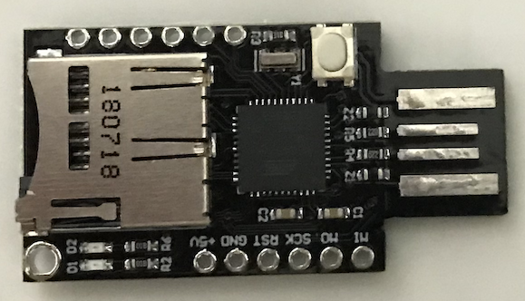
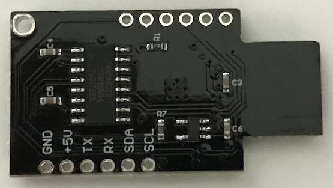

# AnalogWallet

## Introduction
Inspired by the online news about a hardware wallet manufacturer that allows private key extraction via closed source firmware i decided to create my own DIY open source crypto wallet.

## Repo
The repository contains the microcontroller source code, 3D STL & Blender files for the case as well as 10MB of random numbers tested with DieHard. Since there is no hardware random number generator on the module I used, i followed the tests of bloc97 
(https://gist.github.com/bloc97/b55f684d17edd8f50df8e918cbc00f94). His 
example uses an analog input with a delay, in my solution I use the 
registers of the Mega32u4 controller to wait for a new ADC conversion. This speeds up the process of generating random numbers a lot.

## Crypto
Currently all secp256k1 crypto currencies are supported, this includes for example Bitcoin, Ethereum and of course all Ethereum compatible chains.
The wallet provides plain secp256k1 elliptic curve operations:
* Private key generation (random number)
* Public key extraction (on curve)
* Hash signing (for example TX or message signature creation)
* SD Card backup
* SD Card restore

The private key is NEVER stored complete inside the EEPROM or on the SD Card, you always have to provide the correct password to complete the private key. If you enter another password you will end up with another private key that would work too but has no access to your funds.

## Interface
The wallet uses a serial port to communicate with the host system. Inside the py folder you find an example of the protocol used.

## Disclaimer
It should be used only for educational or testing purposes as default 
Arduino boards are not secure, their firmware can be updated from the 
computer and this process doesn't require any user interaction.

## BadUSB!!
ATTENTION! If you receive such a module DON'T plug it into you Computer because you don't know what program is already loaded inside it. You have to flash the module with an ISP or an ArduinoUNO (Arduino ISP example) the first time. Otherwise the module could act as a virtual Keyboard and harm your privacy or data.

