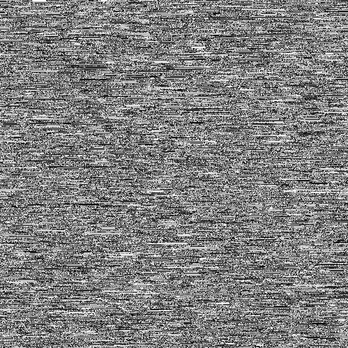
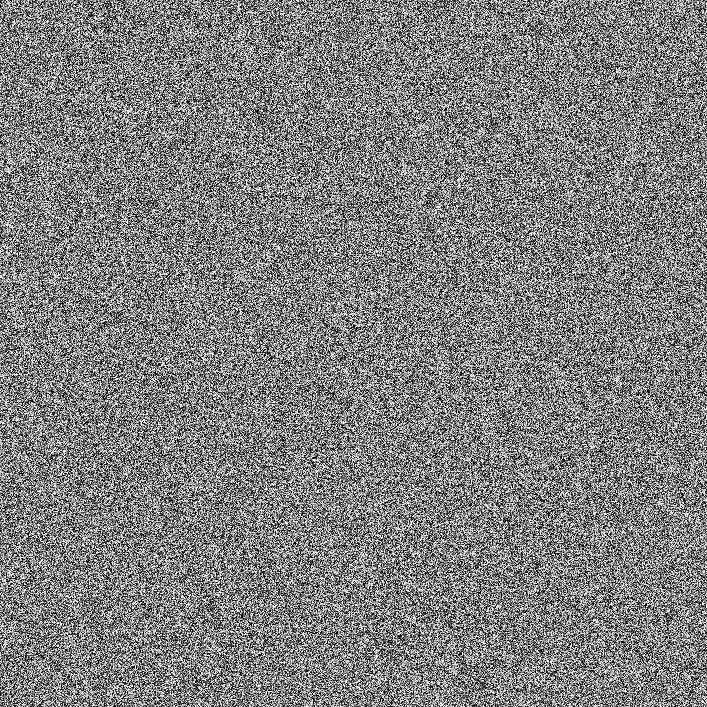
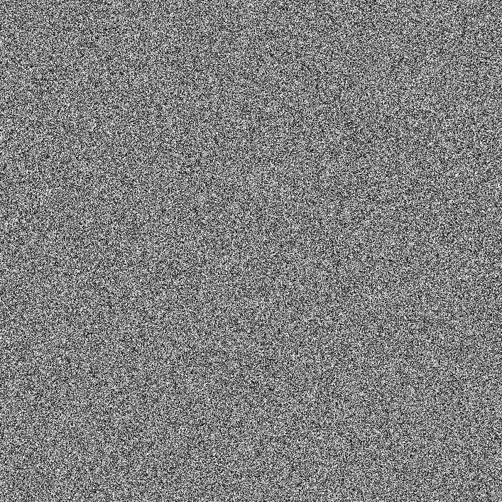
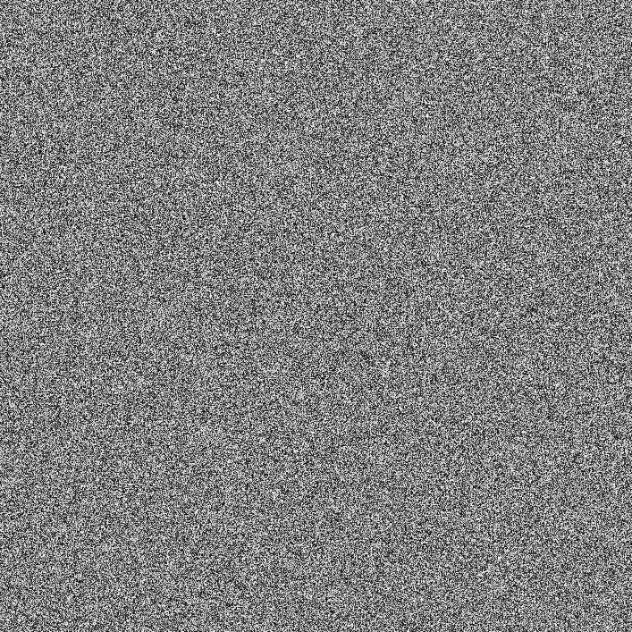
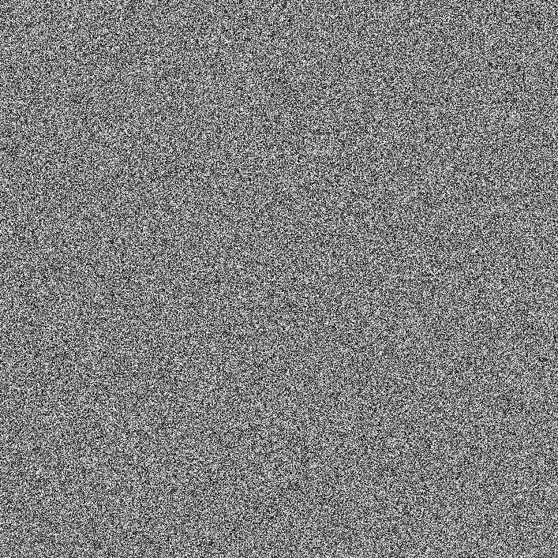

## Info
For an overview over the "true randomness" topic please visit: https://random.org
## Bad randomness (example)

## Good randomness (generated with AnalogWallet)
### ATMEGA32U4 Board 1

### ATMEGA32U4 Board 2

### ATMEGA32U4 Board 3

### ATMEGA328P Board 1

